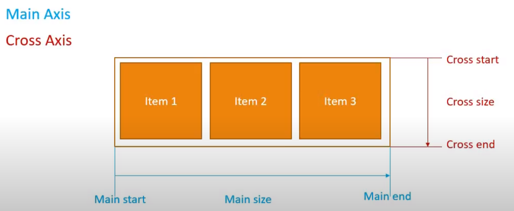

## Terminology

### "Flex Containers and Items

| Flex        | HTML Equivalent |
| -------     | ------------    |
| Container   | Parent Div      |
| Items       | Child Div       |

### Flexbox Axes

* Main Axis: Left to Right
  * main start: "flow from"
  * main end:  "flow to"
  * main size: "taking up
* Cross Axis: Top to Bottom
  * cross start: "flow from"
  * cross end: "from to"
  * cross size: "taking up"
* can alter direction of a axis

