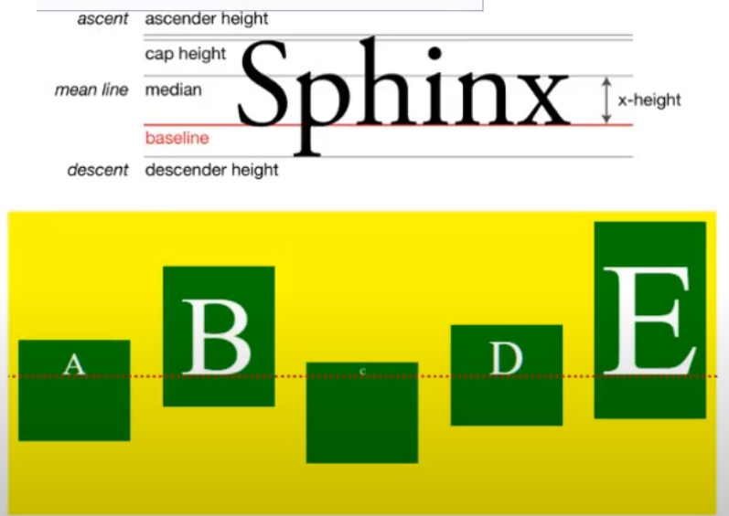

## Algin Items

Defines the default behavior for how flex items are laid out along the *cross axis*
perpendicular to justify-content

Possible Values:
* stretch    - default value; stretch the entire length of the *cross axis*
* flex-start - all the items are pushed to the cross start, starting point of the *cross axis*
* flex-end   - all the items are pushed to the cross end
* center     - centers along the cross axis
* baseline   - 

### Baseline

*def* The line on which most letters sit. Flexbox baseline value for baseline items will align flex items on their contents' baseline

Useful for aligning text within the flex item

