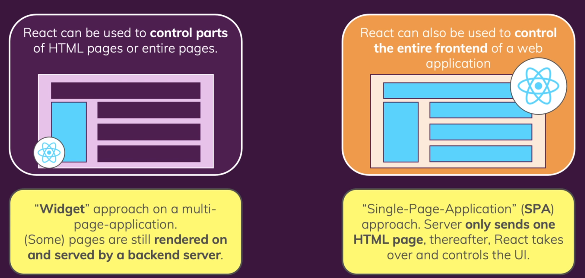
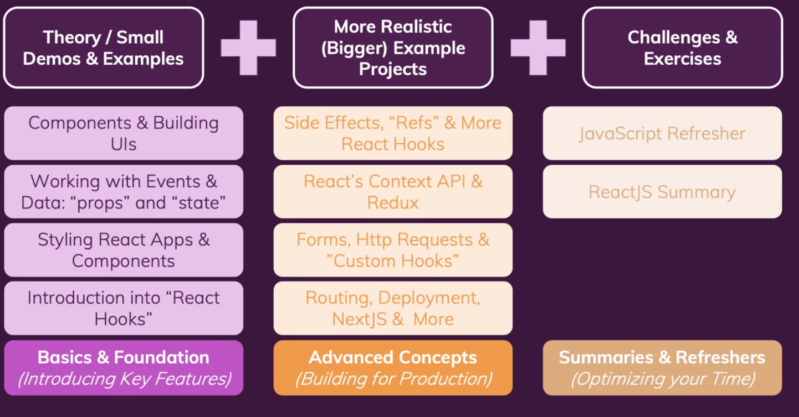

# Getting Started

## What is React and why would we use it? 

Building user interfaces in that web pages are broken up and designed to avoid the long server/request where possible.

Mimics mobile in this respect.

## Why React Instead of "Just JavaScript" ?

### JavaScript
The Native appproach lets one build the minimal amount of JavaScript required.
However, this example shows that this is a copy/paste nightmare without more intelligent usage.

New issues with multiple elements:
* Query selector does not work
  * would need multiple IDs or some other schema to uniquely identify
  * would need to make sure for different views, different overlays and correct "todo" is deleted.
* must write every single step on its own - imperative approach
  * prone to repeative work

### React
Declarative, component-focused approach, "end goal". 

Lets the user define higher-level HTML in the JavaScript code.
Defines the end-result up-front with placeholders and flexible elements with programmatic rendering.

The React Engine/Library handles the actual 'low-level' instructions for us.

### Building Single-Page-Applications (SPAs)
We often build these type of webpages.

## React.js Alternatives

* React: Lean and focused **component-based** UI library; doesn't have many other built-in features.
  * Certain features (e.g. routing) are added via community packages.

* Angular
  * Complete component-based UI framework with features
  * Uses TypeScript
  * Can be overkill for smaller projects
  * Does not rely on community as much

* Vue.js
  * Complete component-based UI framework, includes most core features.
  * A bit less popular React & Angular

## Community

[Community Link](https://academind.com/community)

## Course Outline

Summary of most important features.

* Basics & Foundations (Core/Key Features)
  * Must know no-matter what React.js - scattered throughout
  * Components & Building UIs
    * user interfaces
  * Working with "Events & Data": "props" and "state
    * e.g. How can you listen to button clicks
    * Key React concepts
  * Styling React Apps & Components
  * "React Hooks"
    * Important of modern React.js

* Advanced Concepts (Building for Production)
  * Needed in a lot of apps
  * Side Effects, "Refs" & more Hooks
  * App-wide state management: Reacts Context API & Redux
    * Redux: 3rd party library
  * Forms, HTTP Requests && "Custom Hooks"
  * Routing, Deployment, NextJS & More
    * Illusion of multiple pages
    * Next.js built on-top

* Summaries & Refreshers (Optimizing your Time)
  * Core modern JavaScript features
  * ReactJS Summary

## Get the Most Out Of The Course
* Watch the videos
  * VOD: choose your pace
  * Totally normally to repeat lecture!
* Code Along & Practice
* Debug Errors & Explore Solutions
  * use code attachments

## Environment
