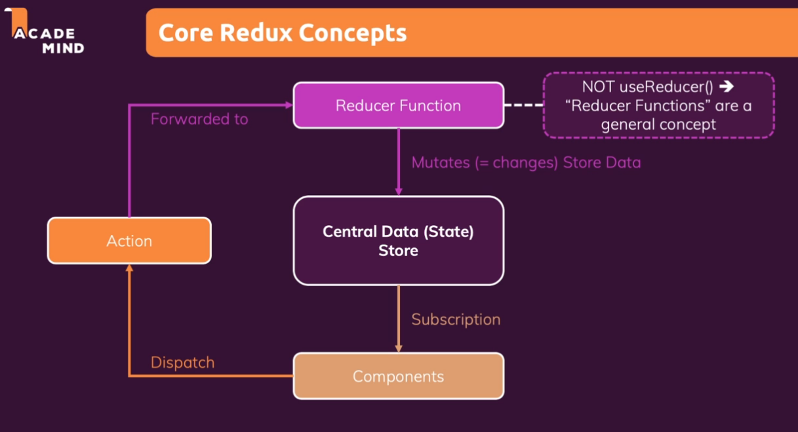

# Diving into Redux (An Alternative to the Context API)

## Module Content
* What is Redux? 
  * Redux Basics & Using Redux with React
  * Managing App-Wide State
  * Redux Toolkit (simplifies Redux)

### Redux - A popular 3rd party librariy
* A state management system for cross-component or app-wide state

Concepts/Ideas that are separations of state
* Local State
  * Data that changes that belogns to a single component
  * e.g. User Input in a state variable
  * e.g. toggling a "show more" details field
  * should be managed with component-internal with ```useState()``` or ```userReducer()```
* Cross-Component State
  * State that affects multiple components
  * e.g. open/close state of a modal overlay
  * multiple components working together
  * Requires "prop chains"/"prop drilling"
    * lends to React Context OR Redux
  * can pass functions as data
* App-Wide State
  * state that affects the entire app (*most*/all components)
  * e.g. user authentication
  * Requires "prop chains"/"prop drilling"
    * becomes cumbersome
    * lends to React Context OR Redux

### Why have Redux when we already have React Context?
* React Context - *Potential* Disadvantages
  * Complex Setup/Management
    * depends on application - but for enterprise, may have a problem like this
```javascript
return (
    <AuthContextProvider>
      <ThemeContextProvider>
        <UIInteractionContextProvider>
          <MultiStepFormContextProvider>
            <UserRegistrationContextProvider>
            ....
)
```

  * even if you collapsed this, the context could be way too large because separation of responsibilites/concerns isn't there
  * Performance - if you're managing the wrong kinds of state
    * React Context is not optimized for high-frequency state changes
  ```
  Ready to be used for low frequency unlikely updates (like locale/theme). It's also good to use it for static values an then propagate updates through subscriptions.
  ```
* But...can pair together!
* 

### Core Redux Concepts

* *One* Central Data (State) Store for the entire application
  * would store auth, themeing, etc. 
  * Data can be used by Components
    * Components setup subscriptions to the data store
    * When data changes, Store notifies Components
    * Components get current data, a slice, and use it accordingly
  * Components never directly the store data
    * Reducer Function - mutates store data
    * ```useReducer ``` and this "Reducer Function" ARE NOT THE SAME
    * transform input and output a new output (usually smaller)
  *  Components *dispatch*/*trigger* Action
    * Action: JavaScript object that describes the kind of operation the reducer should perform
    * Redux forwards Actions to Reducer
 
 

 #### The Reducer Function
 * inputs: old_state, dispatched_action
 * output: a new state object (reality), but can be values
 * should be a pure function (same input values, same outputs)
   * no side effects
  

### Using React and Redux Together
* Can install packages together
```bash
npm install redux react-redux
```

### Using Redux on its own (Pure JavaScript)
* see [code/explore_redux_demo/readme.md](code/explore_redux_demo/readme.md)