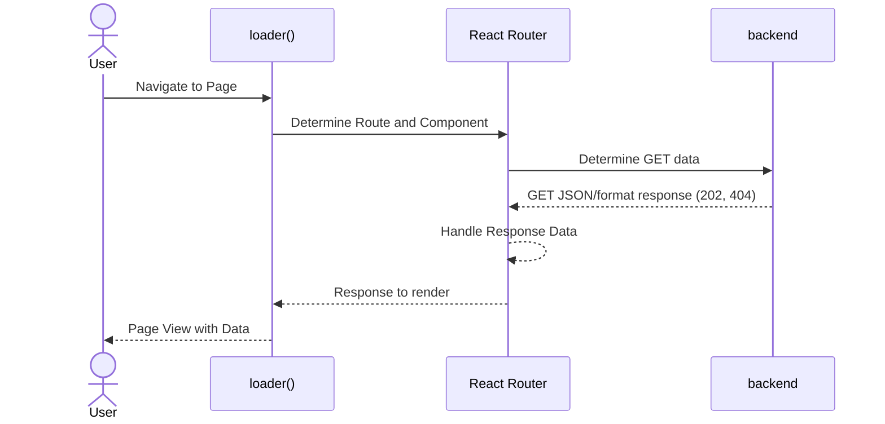
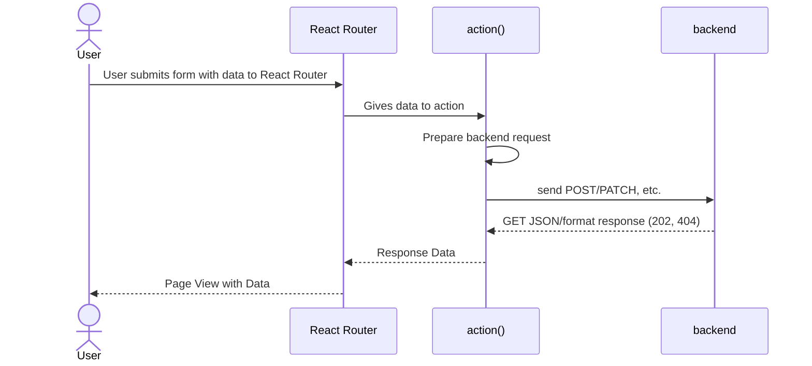

# Section 20: Single-Page Application Routing

## Module Content
* What and Why?
* React-Router, most popular routing package for ReactJS
* Data Fetching & Submission

## What is Routing?

### Multi-Page Routing
* pathways after hostname
* e.g. /welcome
* clckable links take to new content
* per page change, incur new requests + responses
  * HTML is requested and loaded


### Building SPAs
* When building complex user interfaces, we typically build Single Page Applications (SPA)s
* Only one initial HTML request & response
* extra JS code adjusts what user sees
* illusion of routing
* Page (URL) changes are then handled by client-side (React) code -> visible content without fetching a new HTML file
* load a new React component when watching the URL

#### React-Router Package

```bash
npm install react-router-dom
```
### Relative and Absolute Paths

* Absolute paths
```javascript
{
  path: "/",
  children: [
    {
      path: "/products"
    }
  ]
}
```
  * /products and / are directly required in the browser

* Relative Paths:
```javascript
{
  path: "/root",
  children: [
    {
      path: "products"
    },
    {
      path: "products/:id"
    }
  ]
}
```
* will let them be appended as "/root/products"

May have issue in dependent code calls if using aboslute paths.
* absolute - will assume domain name/\<location\>
```javascript
<p>
    Go to <Link to="/products">the list of products</Link>
</p>
```
* relative - will appended to the currently-active route
```javascript
<p>
    Go to <Link to="products">the list of products</Link>
</p>
```

# relative in Link

Two options
* Relative to Currently Active Path
* Relative to Currently Active URL
```javascript
<p>
    Go to <Link to="products" relative="">the list of products</Link>
</p>
```
```
<p><Link relative= "" to="..">Back</Link></p>
relative="route" <-- default
relative="path" <--URL facing
/root
  /products
  /products/:id
/root is the parent from our route/object definition

```

## React Router loader()

* instead of trying to first render a page, then fetch data, then re-populate it
* can instead use the React Router "loader()" to execute a function before trying to load the page
* can use Promises to then use the yielded data immediately on rendering
  * downside on delay time may affect user experience
  * can handle with ```?```
* You can use ```useLoaderData()``` in the element that's assigned to a route AND in all components that might be used inside that element
* loader is called when we start navigating to it

### Where to Store the Loader
* Put loader in the Component File where it's responsible for "bringing it along"

### Error Handling
* can throw Responses
* in the nearest errorElement, can use ```useRouteError```

### defer()

```javascript
export async function loader({request, params}){
  const id = params.eventId;

  return defer(
    {
      event: await loadEvent(id),
      events: loadEvents()
    }
  )
};
```

On a loader function, can ensure something shoud be fetched and promised before
rendering with await (event), while we defer (load after moving to page) the other function data (events)

### action

On using the react-router-dom 
```javascript
<Form method={method}> 
```

You can then tie an ```action:``` and grab the required form elements before sending a request to a backend.  

You should use name and id for fields in the Form in order to use the React Router get functionalities.

## Typical Pathways

### Loader


### Action
