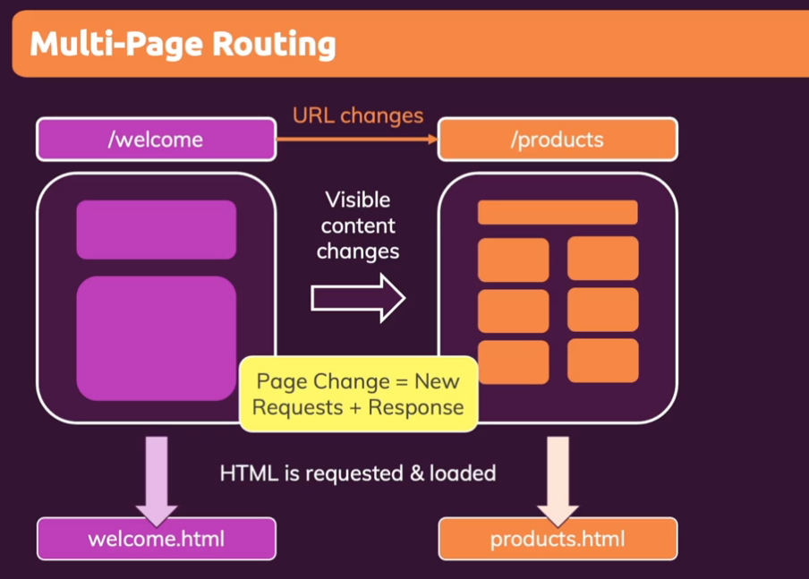

# Section 20: Single-Page Application Routing

## Module Content
* What and Why?
* React-Router, most popular routing package for ReactJS
* Data Fetching & Submission

## What is Routing?

### Multi-Page Routing
* pathways after hostname
* e.g. /welcome
* clckable links take to new content
* per page change, incur new requests + responses
  * HTML is requested and loaded


### Building SPAs
* When building complex user interfaces, we typically build Single Page Applications (SPA)s
* Only one initial HTML request & response
* extra JS code adjusts what user sees
* illusion of routing
* Page (URL) changes are then handled by client-side (React) code -> visible content without fetching a new HTML file
* load a new React component when watching the URL

#### React-Router Package

```bash
npm install react-router-dom
```
