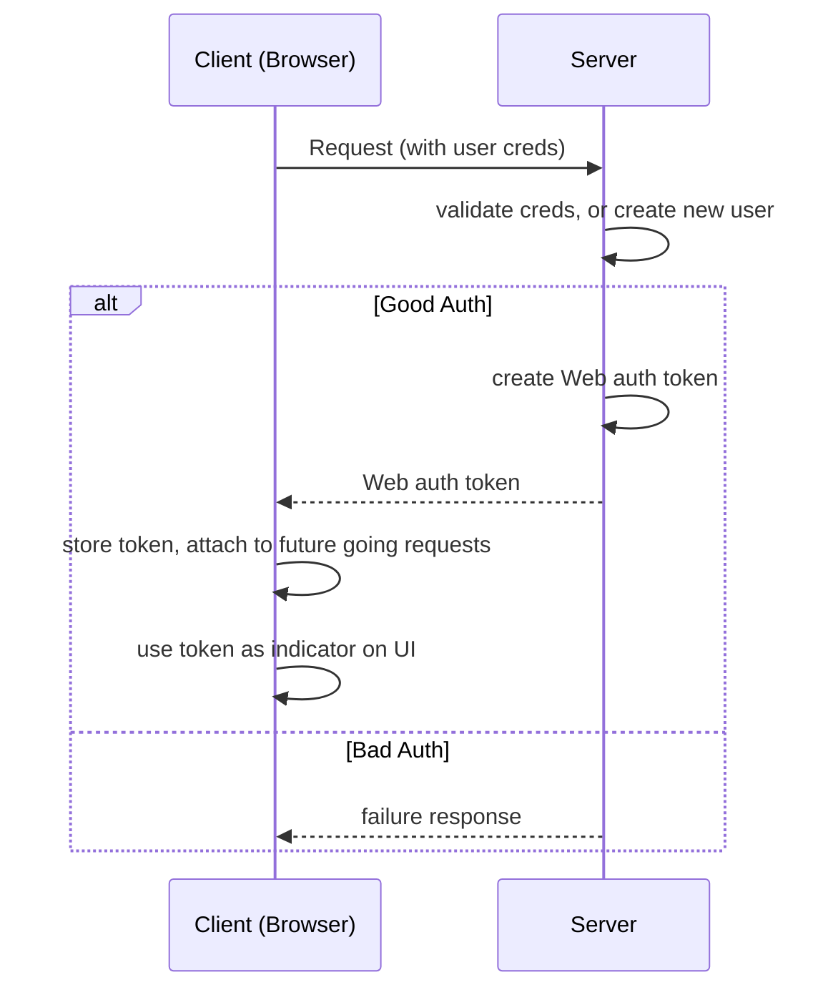

# Adding Authentication React Apps
Module Content:
* How Authentication Works in React Apps
* Implementing User Authentication
* Adding Auth Persistence & Auto-Logout
* New Routing Concepts
  * Query Parameters
  * Route Protection

## How Authentication Works

Authentication is needed if content/resources (e.g. backend routes) should be *protected* - not accessible by everyone

Getting Permission

### Server-Side Sessions
* Popular in full stack applications where no decoupled front-end/back-end
  * back-end must store info about back-end
* Store unique identifer on server, send same identifer to client
* Client send identifier along with requests to protected resources

### Authentication Token
* Talking to de-coupled backend who don't store client info
* create (but not store) "permission" token on server, send token to client
  * e.g. OAuth2.0
  * validality is verified by private key on backend
* client sends oktne along with requests to protected resources